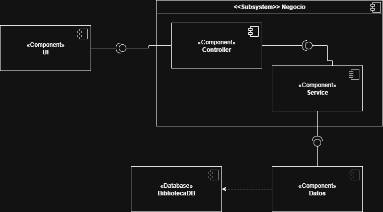

---

# Arquitectura del Sistema de Biblioteca

El sistema se organiza en **tres capas principales**:

1. **Capa de Presentación (Vista del Cliente)**
2. **Capa de Lógica de Negocio (Gestión y Servicios)**
3. **Capa de Datos y Persistencia**

---

## 1. Capa de Presentación

**Función:**
Permite que los usuarios interactúen con el sistema.

**Responsabilidades:**

* Capturar los datos ingresados por el usuario.
* Enviar las solicitudes a la capa de negocio.
* Mostrar los mensajes e información por pantalla.

**Elementos:**
Formularios de registro de socios/libros, pantallas de búsqueda de libros, menús de navegación.

---

## 2. Capa de Lógica de Negocio

**Función:**
Implementa la lógica del dominio.

**Responsabilidades:**

* Validar los datos recibidos.
* Coordinar la interacción entre sus distintos módulos.
* Aplicar las políticas del negocio.

**Elementos:**
Módulo `GestorLibros`, módulo `GestorSocio`, módulo `SocioService`.

---

## 3. Capa de Datos y Persistencia

**Función:**
Se encarga de la recuperación y administración de la información.

**Responsabilidades:**

* Ejecutar consultas para crear, leer, actualizar o eliminar datos (CRUD).
* Mantener la integridad de la base de datos.
* Proveer datos a la capa de negocio de manera controlada.

**Elementos:**
Tablas: `Libro`, `Socio`,
Módulo de conexión.

---

## Diagrama de Componentes del Sistema de Biblioteca

